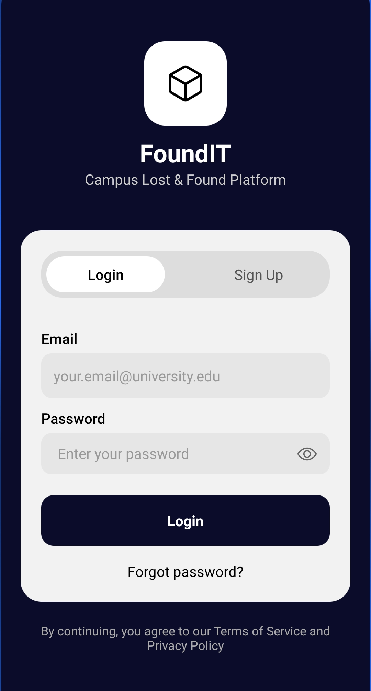
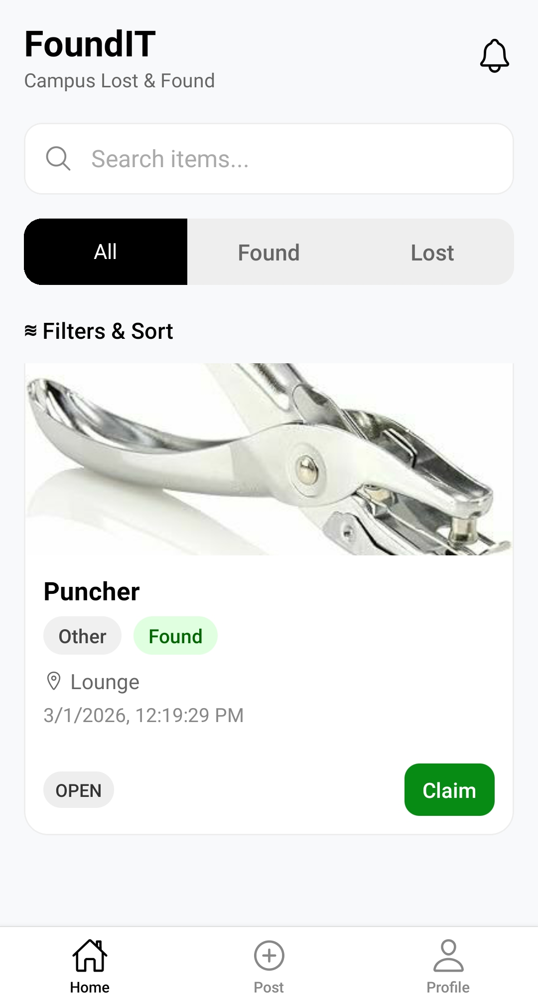
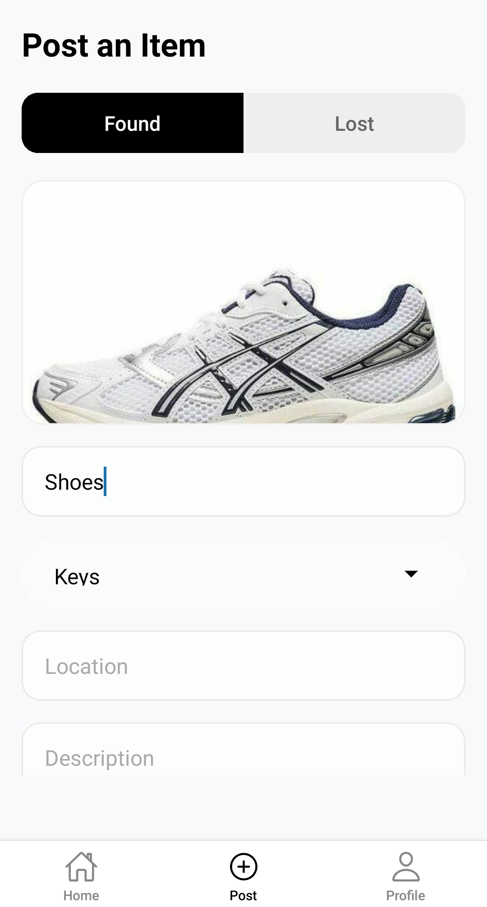
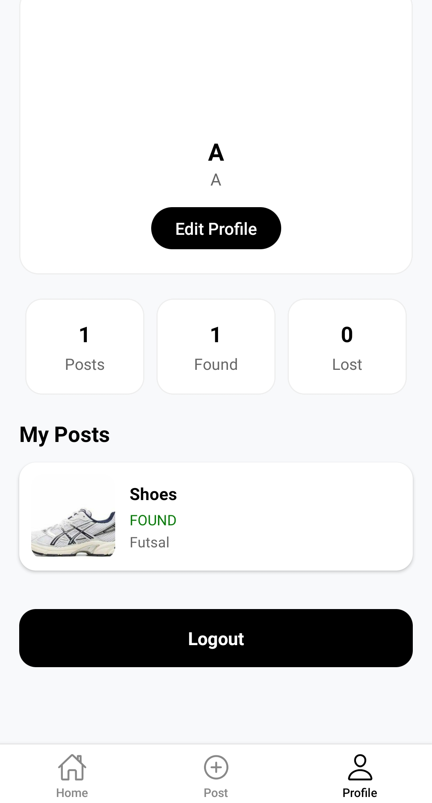
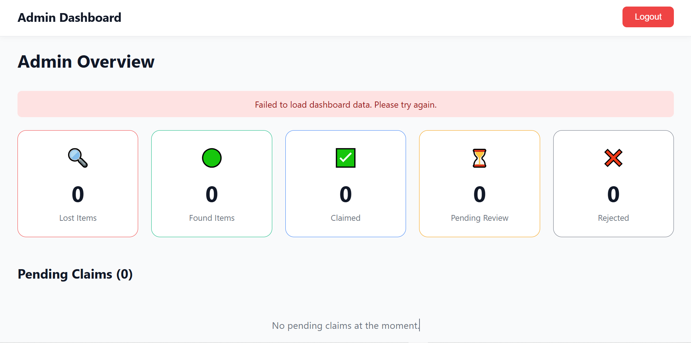

# 📦 FoundIT – Lost & Found Management System

FoundIT is a full-stack Lost and Found Management System designed to help students report, search, and manage lost and found items efficiently.

The system includes:

- 📱 Mobile App (User Side)
- 🖥 Admin Web Dashboard
- 🌐 Backend API (Node.js + Express + MongoDB)

---

# 🚀 Features

## 👤 User Mobile App
- User Registration & Login
- Secure Signup & Authentication (JWT)
- Post Lost Items
- Post Found Items
- Upload Item Images
- View Item Status (Pending, Claimed, Rejected)
- Profile Management

## 🛠 Admin Web Dashboard
- Admin Login
- View All Items
- Filter by Status:
  - Lost
  - Found
  - Pending
  - Claimed
  - Rejected
- Approve or Reject Posts
- Mark Items as Claimed
- Manage Users

---

# 🏗️ System Architecture

Mobile App (React Native / Expo)  
Admin Web (React.js)  
Backend API (Node.js + Express.js)  
Database (MongoDB)

---

# 📂 Project Structure

```
FoundIT/
│
├── Backend/
│   ├── config/
│   ├── models/
│   ├── routes/
│   ├── middleware/
│   └── server.js
│
├── mobile-app/
│
├── Admin/frontend
│
├── screenshots/
│
└── README.md
```

---

# ⚙️ Backend Setup

## 1️⃣ Install Dependencies

```bash
cd backend
npm install
```

## 2️⃣ Create `.env` File

Create a `.env` file inside the backend folder:

```
PORT=5000
MONGO_URI=my_mongodb_connection_string
JWT_SECRET=my_secret_key
```

## 3️⃣ Start Server

```bash
npm start
```

Server runs on:

```
http://localhost:5000
```

---

# 📱 Mobile App Setup

```bash
cd mobile-app
npm install
npx expo start
```

---

# 🖥 Admin Web Setup

```bash
cd admin-web
npm install
npm start
```

---


# 🔐 Authentication

- JWT-based authentication
- Role-based access control (User / Admin)
- Protected routes using middleware

---

# 📊 Item Status Workflow

1. User posts item → **Pending**
2. Admin reviews → **Approved** or **Rejected**
3. Approved items can be marked as **Claimed**

---

## 🔐 Login Screen


---


## 🏠 Home Screen


---

## ➕ Post Item Screen


---

## 👤 Profile Screen


---

## 🖥 Admin Web Dashboard


---

# 🛠 Tech Stack

- Frontend (Mobile): React Native (Expo)
- Frontend (Admin): React.js
- Backend: Node.js + Express.js
- Database: MongoDB
- Authentication: JSON Web Token (JWT)
- Image Upload: Multer / Cloudinary (if configured)

---

# 🎯 Future Improvements

- Push Notifications
- Email Notifications
- Real-time Chat between finder and owner
- Advanced Search & Filtering
- Dark Mode Support
- Cloud Deployment (Render / Railway / Netlify)


